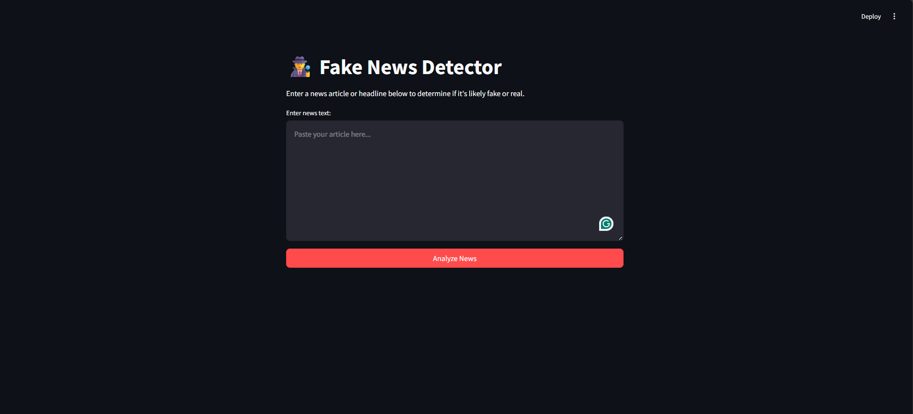
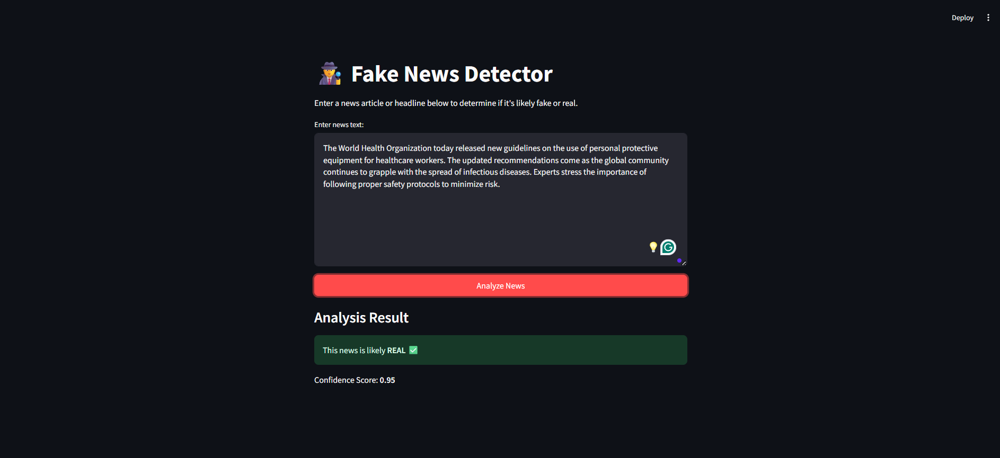

# 🕵️ Fake News Detector App

This is an end-to-end data science project that demonstrates the entire workflow of building and deploying a machine learning application. It uses a Deep Learning model to classify a given news article as either **REAL** or **FAKE**. The model is trained on a public dataset and then deployed as an interactive web application using Streamlit.

## ✨ Features

* **Deep Learning Model:** Utilizes a Long-Short Term Memory (LSTM) recurrent neural network.
* **Data Preprocessing:** Cleans and tokenizes raw text data.
* **Class Balancing:** Addresses imbalanced data to prevent model bias.
* **Interactive UI:** A user-friendly interface built with Streamlit.

## 🛠️ Technology Stack

* **Python:** The core programming language.
* **TensorFlow/Keras:** For building and training the deep learning model.
* **Pandas & NumPy:** For data manipulation.
* **scikit-learn:** For data splitting and evaluation.
* **NLTK:** For natural language processing tasks.
* **Streamlit:** For creating the web application UI.

---

## 🚀 How to Run the Project Locally

### 1. Clone the repository

Open your terminal and clone the project to your local machine:

git clone [https://github.com/Subhaga2000/Fake-News-Detector-App.git](https://github.com/Subhaga2000/Fake-News-Detector-App.git)
cd Fake-News-Detector-App

### 2. Download the Dataset 💾

This project's dataset is not included in the repository due to its large size. You can download it for free from Kaggle.

* Download the `Fake.csv` and `True.csv` files from [this Kaggle link](https://www.kaggle.com/datasets/emineyetm/fake-news-detection-datasets).
* Create a new folder named `data` in your project's root directory.
* Place the downloaded `Fake.csv` and `True.csv` files inside the `data` folder.

### 3. Set Up the Environment 🐍

It's highly recommended to use a virtual environment to manage dependencies.

#### Create and activate virtual environment
`python -m venv venv`

#### On Windows:
`venv\Scripts\activate`

#### On macOS/Linux:
`source venv/bin/activate`

### 4. Install the required libraries listed in requirements.txt:

`pip install -r requirements.txt`

### 5. Train the Model 🧠
Run the main script to process the data and train the model. This will create the necessary model files (fake_news_model.h5 and tokenizer.pkl) that the app needs.

`python main_script.py`

### 6. Run the Streamlit App 🚀

Finally, launch the web application.

`streamlit run app.py`
